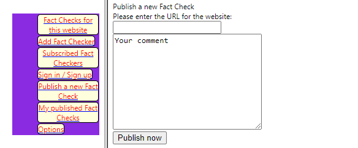

# Archicheck Front Tests
**Author**: Benjamin Müller  
**Date**: December 2021

This document will protocol my testing approaches in regards of testing the Archi-check fronted.
The frontend consists out of three parts that can be tested. Firstly the JavaScript code implementation, secondly 
the interaction and look of the UI as well as its usability in regards of understanding and learning it and lastly inputs
you can feed into the application.

### 1. JavaScript testing
In the aspect of javascript we have currently the background.js that can be tested according to Felix. In more detail 
the low_level_calls of POST and GET. The second part that can be tested is the crypto.js where the encryption and
decryption of public and private key happens.

#### 1.1 Testing low_level_calls GET
I couldn't find any errors.

#### 1.2 Testing low_level_calls POST
I couldn't find any errors.

#### 1.3 Testing crypto.js
This is still worked on by Finn. Will be reviewed and checked as soon as he is done implementing
it.

### 2. UI testing
Currently, nothing to be tested.

### 3. Input testing
Here certain inputs that a user can do is checked and generally if the addon from a user perspective does what its supposed
to do. The current state of the application is that the sign-up button will be reworked and the myPublishedFactCheck 
aswell as subscripedFactCheck aren't implemented yet. Therefore, we remain with the following buttons to test with:
- Fact Checks for this Website
- Add Fact Checker
- Publish a new Fact Check
- Options

First I noticed that there is no check how fast a request can be sent. This could be abused to 
flood the server with requests. I tested this with an auto clicker and saw that you are able to send up to 36 requests
manually, however I believe that if you send requests directly with the help of code, you can send a lot more.

#### 3.1 Testing Publish a new Fact Check
My first test was trying out if SQL injection works. 
I refer to "Please enter the URL for the website:" as field1 and to "Your comment" as field2.  

##### 3.1.1 Test 1 - SQL Injection
Trying some random SQL string to see if anything happens  
**Input**: "1; DROP TABLE Suppliers"  
**Result**: The string got added to the fact checks for the website
##### 3.1.2 Test 2 - SQL Injection
Trying another SQL string to see if anything happens  
**Input**: "" or ""=""  
**Result**: The database stopped responding and fact checks weren't shown anymore. No new fact checks
were added when I tried to add new.